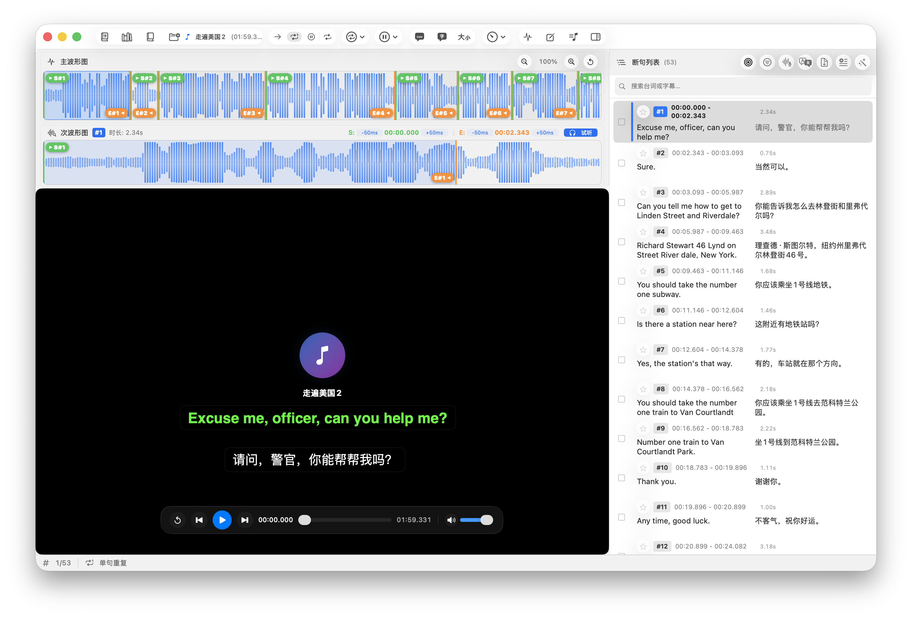

# StudyMate（学伴）

原来使用windows的时候，很喜欢Aboboo这款软件，可惜一直没有等来macOS版本，于是就有了自己实现的想法，所以首先应该致敬Aboboo。

StudyMate（学伴）是一款面向 macOS 的原生英语听力学习与音、视频复读工具，使用 Swift、SwiftUI、AppKit 构建的原生应用程序。

## 当前功能

- 音频、视频播放，系统解码、扩展解码和智能混合解码实现绝大多数音、视频格式的播放。
- 快速断句与智能断句两种模式
  - 快速断句：适合背景音简单的音、视频，不会自己生成原文。
  - 智能断句：适合有嘈杂背景音的多人对话材料，会自动区分说话人角色，进行断句。可选自动生成原文。
- 主波形图与当前句次波形图，支持直接拖动句首/句尾边界，支持50ms的微距调节。
- 原文、译文字幕编辑。
- 连续播放、单句重复、句后停顿、全篇循环。
- 句子筛选、批量导出 AAC M4A 与双语 LRC/SRT
- 支持多句库管理。
- 通过大模型自动翻译原文，支持DeepSeek、Gemini，以及 OpenAI/Anthropic 协议的自定义翻译服务，需要你自己准备api key.
- 词典功能：独立词典引擎（Rust 实现）：导入标准 MDX/MDD v1、v2，支持 UTF-8/UTF-16/GBK/Big5、zlib/LZO、精确和前缀查询，并兼容 `Encrypted=2` 的索引混淆；需要注册码的 `Encrypted=1/3` 文件支持通过 `RegCode/.key` 与用户标识派生解密密钥。说不定后面可以扩展为独立的mdx词典软件。
- 支持对断句列表中句子，字幕原文和译文进行双击查词和拖动选择查词，调用的自带 mdx 词典进行。(字幕拖动要先按住option或者command，然后再拖)
- 也支持三指点击(control+command+d)调用macOS系统字典进行查词。
- 支持生词本功能。

## 断句流程

如果学习媒体材料自带字幕，则会直接合作字幕文件断句，没有字幕文件时才会自动断句。字幕文件与媒体文件同名会自动使用，也可以打开媒体文件后，拖动加载字幕文件。

使用到的开源语音AI离线模型：Silero-VAD, SpeakerKit, Whisper

1. Silero VAD 输出逐帧概率和语音区间。
3. SpeakerKit 在本地使用随应用提供的 Core ML 模型分析说话人轮次和重叠语音；超过五分钟的媒体按带上下文重叠的窗口处理，并通过重叠证据和说话人中心向量维持跨窗口身份一致。
4. 智能断句额外通过应用内 whisper.cpp 获取词级时间戳、标点和语义证据；每个识别窗口直接读取对应映射范围。
5. 全局边界优化器综合声学停顿、VAD 概率、说话人变化、Whisper 结果和句长硬上限，生成不重叠的断句。

快速断句只运行 Silero 与 SpeakerKit，优先速度和资源占用；智能断句完整联动 Silero、SpeakerKit 与 Whisper，适合需要更精准语义边界的材料。智能断句可选生成原文。

## 数据与隐私

- AI 识别、Silero、SpeakerKit 和 Whisper 均在本机运行；SpeakerKit 模型随应用打包，不需要首次联网下载。
- Whisper 模型按需下载到 `~/Library/Application Support/StudyMate/Models/`。
- PCM、工程和句库数据保存在 `~/Library/Application Support/StudyMate/`。
- 从播放列表或欢迎页移除媒体、或清空播放列表时，只保留原始音视频文件；对应工程、波形和 PCM 派生缓存会一并清理。

- 每次实际覆盖工程或波形缓存前，会在 `Projects/` 下保留最近 5 个独立备份快照；从播放列表删除媒体时，对应备份也会一起删除。
- 翻译服务使用的 API Key 仅保存在 macOS 钥匙串；翻译请求只在用户明确点击“开始翻译”后发送。

- mdx 词典安装到 `~/Library/Application Support/StudyMate/Dictionaries/<dictionary-id>.mabdict/`。

## 环境要求

- macOS 26 或更高版本
- Xcode 26 或更高版本（项目源码保持 Swift 5 语言模式）
- Apple Silicon 或 Intel Mac

## 构建与测试

使用 Xcode 打开 `StudyMate.xcodeproj`，选择 `StudyMate` scheme 后运行。

也可以使用 Swift Package Manager：

```bash
swift build
swift test

# 单独检查词典核心
cargo test --manifest-path Dictionary/Cargo.toml --workspace
```

发布包由 `Scripts/` 中的构建脚本生成到 `dist/`，同时包含应用需要的模型、动态库和资源。

## 许可证

第三方组件的许可证位于 `Sources/StudyMate/Resources/ThirdPartyNotices/` 和 `Vendor/Whisper/LICENSE`。发布应用时请同时遵守各依赖项目的许可证要求。

## 打不开？

### 方法一

1. 把 `StudyMate.app` 拖入「应用程序」文件夹
2. **不要双击打开**
3. 在访达，**按住 Control‑键 + 点击 App 图标 → 打开**
4. 在弹窗点「打开」。

>
> 如果弹出被阻止：打开「系统设置 → 隐私与安全性」往下滑，点击 **仍要打开**，输入管理员密码即可。
> ✅效果：这台电脑永久记住例外，以后双击正常打开。

### 方法二

```
sudo xattr -rd com.apple.quarantine /Applications/StudyMate.app
sudo codesign --force --deep --sign - /Applications/StudyMate.app
```

